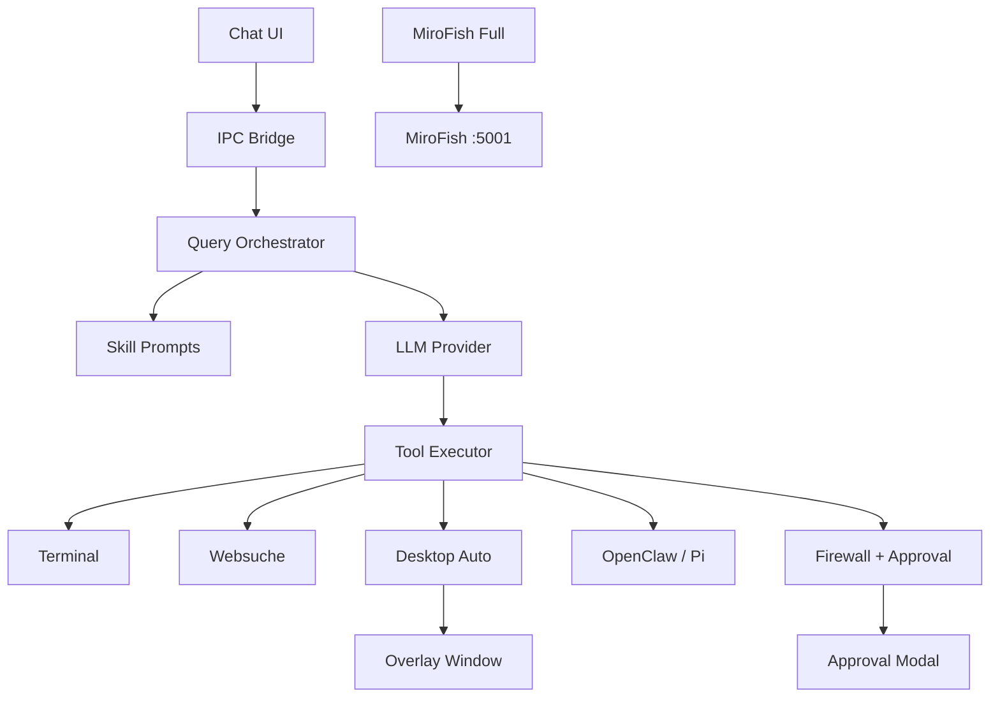

# Feature-Übersicht — Desktop Mini Agent

**Version:** 1.1.5  
**Stand:** Juni 2026

---

## Feature-Matrix

| # | Feature | Beschreibung | Skills / Module | Status |
|---|---------|--------------|-----------------|--------|
| F-01 | **Floating Chat UI** | Transparentes Electron-Fenster (480×780), Bubble-Modus, always-on-top | `index.html`, `renderer.js` | ✅ |
| F-02 | **Tray-Integration** | Hintergrund-Betrieb, Fenster-Toggle, Screenshot-Menü | `main.js` (Tray) | ✅ |
| F-03 | **Multimodaler Chat** | Text + Screenshot + Dateianhänge (PDF) | `process-query` IPC | ✅ |
| F-04 | **Markdown-Rendering** | Sichere HTML-Ausgabe für Agent-Antworten | `marked`, `DOMPurify` | ✅ |
| F-05 | **Skill-System** | 15+ vordefinierte Skills, kombinierbar | `defaultSkills`, UI-Badges | ✅ |
| F-06 | **Auto-Pilot** | LLM-Router wählt Skills automatisch | Skill `auto` | ✅ |
| F-07 | **Custom Skills** | Nutzer-definierte Prompts im Settings-Panel | `customSkills` in config | ✅ |
| F-08 | **Kontext-Heatmap** | Visueller Füllstand der Chat-History (20 Msg.) | Brain-Icon, Farbverlauf | ✅ |
| F-09 | **Smart Handover** | LLM-komprimierte Kontext-Übergabe | `context_heatmap_handover.md` | ✅ |
| F-10 | **Screenshot Auto-Capture** | Automatischer Vollbild-Screenshot bei Query | `screencapture`, `sips` | ✅ |
| F-11 | **Interactive Screenshot** | macOS-Ausschnitt-Tool + HTTP-Trigger :14111/crop | Tray, `take-interactive-screenshot` | ✅ |
| F-12 | **Websuche** | DuckDuckGo Lite HTML-Parser | Tool `search_web` | ✅ |
| F-13 | **Produktpreis-Suche** | Preis-Tiles mit Thumbnails | Tool `search_product_prices`, Skill `mrbillig` | ✅ |
| F-14 | **Deep Research** | Iterative Mehrfach-Suche → Dossier | Skill `deepresearch` | ✅ |
| F-15 | **Dokument-Erstellung** | Markdown/HTML-Dateien als Download | Tool `create_document` | ✅ |
| F-16 | **Terminal-Ausführung** | Bash/Zsh-Befehle mit Output-Rückgabe | Tool `execute_terminal_command` | ✅ |
| F-17 | **KI-Firewall** | Risiko-Bewertung vor Terminal-Ausführung | `gpt-4o-mini`, `checkWithFirewall` | ✅ |
| F-18 | **Approval-Modal** | Nutzer-Bestätigung für riskante Aktionen | IPC `show-approval-popup` | ✅ |
| F-19 | **AppleScript** | macOS-App-Steuerung via `osascript` | Tool `execute_applescript` | ✅ |
| F-20 | **Datei-Bearbeitung** | Search/Replace oder Vollüberschreibung | Tool `edit_file` | ✅ |
| F-21 | **Desktop-Automatisierung** | Maus/Tastatur via nut.js + Overlay | Skill `assistenz`, `overlay.html` | ✅ |
| F-22 | **Assist-Risk-Modi** | guided / assist / auto | Setting `assistRisk` | ✅ |
| F-23 | **OpenClaw-Delegation** | High-Level OS-Tasks | Skill `mac_controller` | ✅ |
| F-24 | **Pi Coding Agent** | Externe Code-Agent-Delegation | `delegate_to_pi_coding_agent` | ✅ |
| F-25 | **Trading-Analyse** | CRV, Stochastik, Price Action | Skills `tradingexpert`, `stockcheck` | ✅ |
| F-26 | **MiroFish Lite** | In-Chat Prognose-Simulation | Skill `mirofish` | ✅ |
| F-27 | **MiroFish Full** | 7-Schritt-Backend-Pipeline (5–10 Min.) | `mirofish_orchestrator.js`, :5001 | 🔶 |
| F-28 | **Voice Input** | Mikrofon → OpenAI Whisper | IPC `transcribe-audio` | ✅ |
| F-29 | **Voice Output** | OpenAI TTS oder Browser-Speech | IPC `synthesize-speech` | ✅ |
| F-30 | **Wake Word** | Kontinuierliche Spracherkennung | Web Speech API, `wakeWord` | ✅ |
| F-31 | **Multi-LLM-Support** | OpenAI, Gemini, Ollama, lokales Llama Vision | `main.js` Provider-Routing | ✅ |
| F-32 | **Lokales Modell** | GGUF-Download (~8 GB), Metal/GPU | `node-llama-cpp` | ✅ |
| F-33 | **API-Key-Verschlüsselung** | Electron safeStorage | `getConfig` / `saveConfig` | ✅ |
| F-34 | **Kosten-Tracking** | Kumulierte USD pro Session | `totalCost` | ✅ |
| F-35 | **Agent-Log-Stream** | Echtzeit-Aktionen im Logs-Panel | Event `agent-log` | ✅ |
| F-36 | **MiroFish-Backend-Spawn** | Auto-Start Python-Backend bei App-Start | `main.js` spawn | 🔶 |
| F-37 | **Single-Instance** | Nur eine App-Instanz | `requestSingleInstanceLock` | ✅ |
| F-38 | **HTTP Crop-Server** | Externer Shortcut-Trigger | `127.0.0.1:14111/crop` | ✅ |

**Legende:** ✅ produktiv | 🔶 externe Abhängigkeit (MiroFish-Ordner, Port 5001)

---

## Feature nach Kategorie

### Benutzeroberfläche
- Floating Window, Bubble-Modus, Tray
- Chat mit Markdown, Skill-Badges, Settings, Logs
- Approval-Modal, MiroFish-Animation
- Kontext-Heatmap (Brain-Icon)

### Intelligenz & Prompts
- Franki-Basis-Persona (`DEFAULT_PROMPT`)
- Skill-Prompt-Injection
- Auto-Pilot Router
- Scratchpad-Pflicht (Assistenz, Mac Controller)
- Tool-Calling-Loop (OpenAI)

### Systemintegration (macOS)
- Screenshot (`screencapture`, `sips`)
- Terminal, AppleScript, Dateisystem
- Maus/Tastatur (`@nut-tree-fork/nut-js`)
- Berechtigungen: Bildschirmaufnahme, Bedienungshilfen, Mikrofon

### Externe Dienste
| Dienst | Verwendung |
|--------|------------|
| OpenAI | Chat, Firewall, Whisper, TTS |
| Google Gemini | Chat (ohne Tool-Loop) |
| DuckDuckGo | Websuche, Produktbilder |
| HuggingFace | GGUF-Modell-Download |
| MiroFish (:5001) | Full Simulation |
| OpenClaw | OS-Automatisierung |
| Pi Coding Agent | Code-Delegation |
| Ollama / LM Studio | Lokale OpenAI-kompatible API |

### Sicherheit
- KI-Firewall für Terminal
- AppleScript-Blocklist (rm, sudo, killall, …)
- Approval-Popup für Terminal, Datei, Automation, Agent-Delegation
- Sandbox Renderer (`contextIsolation: true`)
- Verschlüsselte API-Keys

---

## Feature-Abhängigkeiten

---

## Nicht-Features (bewusst ausgeschlossen)

- Windows/Linux-Support
- Cloud-Sync der Chat-History
- Multi-User / Team-Modus
- Integrierter Code-Editor
- Automatische Updates (OTA)
