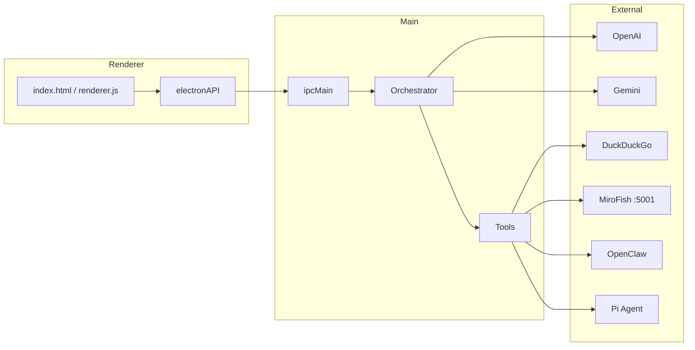

# Schnittstellenübersicht — Desktop Mini Agent

**Version:** 1.1.5

---

## 1. Interne Schnittstellen (IPC)

Kommunikation zwischen Renderer (`renderer.js`) und Main-Prozess (`main.js`) über `preload.js` → `window.electronAPI`.

### 1.1 Invoke (Request/Response)

| API-Methode | IPC-Channel | Parameter | Rückgabe | Beschreibung |
|-------------|-------------|-----------|----------|--------------|
| `processQuery(data)` | `process-query` | `{ query, screenshotPath, history, skills, files }` | `{ text, totalCost }` oder `{ error }` | Haupt-Agent-Loop |
| `getConfig()` | `get-config` | — | `Config`-Objekt | Lädt Einstellungen + Skills |
| `saveConfig(config)` | `save-config` | Teil-/Vollconfig | — | Speichert + sync MiroFish `.env` |
| `sendApprovalResult(approved)` | `approve-command` | `{ approved: boolean }` | — | Antwort auf Approval-Modal |
| `takeInteractiveScreenshot()` | `take-interactive-screenshot` | — | Screenshot-Pfad | macOS Crop-Tool |
| `saveDocument(path, filename)` | `save-document` | `{ path, filename }` | Ergebnis Save-Dialog | Native Dateispeicherung |
| `transcribeAudio(buffer)` | `transcribe-audio` | `ArrayBuffer` | Transkript-Text | OpenAI Whisper |
| `synthesizeSpeech(text)` | `synthesize-speech` | `string` | Audio-Buffer/Base64 | OpenAI TTS |

### 1.2 Send (Fire-and-Forget)

| API-Methode | IPC-Channel | Parameter | Beschreibung |
|-------------|-------------|-----------|--------------|
| `closeWindow()` | `close-window` | — | Fenster verstecken |
| `setWindowMode(mode)` | `set-window-mode` | `'bubble'` \| `'expanded'` | UI-Modus wechseln |
| `startModelDownload()` | `start-model-download` | — | GGUF-Download starten |

### 1.3 Events (Main → Renderer)

| Listener | Event | Payload | Beschreibung |
|----------|-------|---------|--------------|
| `onAgentLog(cb)` | `agent-log` | `string` | Log-Zeile für Logs-Panel |
| `onShowApproval(cb)` | `show-approval-popup` | `{ type, description, ... }` | Approval-Modal anzeigen |
| `onScreenshotTaken(cb)` | `screenshot-taken` | Pfad | Screenshot fertig |
| `onForceExpandedMode(cb)` | `force-expanded-mode` | — | Bubble → Expanded |
| `onModelDownloadRequired(cb)` | `model-download-required` | — | Lokales Modell fehlt |
| `onModelDownloadProgress(cb)` | `model-download-progress` | `{ percent, ... }` | Download-Fortschritt |
| `onSimulationStart(cb)` | `simulation-start` | — | MiroFish Full startet |
| `onSimulationEnd(cb)` | `simulation-end` | — | MiroFish Full beendet |

**Quelle:** `preload.js`

---

## 2. Lokaler HTTP-Server

| Endpoint | Methode | Port | Beschreibung |
|----------|---------|------|--------------|
| `/crop` | GET | `14111` | Triggert interaktiven Screenshot (externe Shortcuts) |

**Bindung:** `127.0.0.1` (nur localhost)

---

## 3. LLM Function-Calling Tools

Definiert in `main.js`; Verfügbarkeit abhängig von aktiven Skills.

| Tool | Parameter | Skill-Gate | Beschreibung |
|------|-----------|------------|--------------|
| `search_web` | `search_query` | `web`, `stockcheck`, `tradingexpert`, `deepresearch`, `mirofish` | DuckDuckGo-Suche |
| `search_product_prices` | `search_query` | `mrbillig` | Preis-Tiles mit Bildern |
| `open_website` | `url` | Web-Skills | Browser öffnen |
| `create_document` | `filename`, `content` | immer | Temp-Datei + Download |
| `execute_terminal_command` | `command` | immer | Bash/Zsh (Firewall + Approval) |
| `execute_applescript` | `script` | immer | osascript (Blocklist) |
| `edit_file` | `file_path`, `search_string`, `replacement_string`, `content` | immer | Datei bearbeiten |
| `execute_computer_action` | `actions[]` | `assistenz` | Maus/Tastatur (nut.js) |
| `execute_advanced_os_task` | `task_description` | immer | OpenClaw-Delegation |
| `delegate_to_pi_coding_agent` | `task_description` | immer | Pi Coding Agent |

### `execute_computer_action` — Action-Schema

```json
{
  "actions": [
    { "type": "move", "x": 0.5, "y": 0.3, "rationale": "...", "risk_level": "low" },
    { "type": "click", "button": "left", "rationale": "...", "risk_level": "low" },
    { "type": "type", "text": "Hello", "rationale": "...", "risk_level": "low" }
  ]
}
```

Koordinaten: relativ `0.000`–`1.000` (Prozent des Bildschirms).

---

## 4. Externe APIs

### 4.1 OpenAI

| Endpoint | Verwendung |
|----------|------------|
| `POST /v1/chat/completions` | Haupt-Chat, Tool-Loop, Auto-Pilot, Firewall, Handover |
| `POST /v1/audio/transcriptions` | Whisper (Voice Input) |
| `POST /v1/audio/speech` | TTS (Voice Output) |

**Modelle (typisch):** `gpt-4o`, `gpt-4o-mini` (Firewall/Router)

### 4.2 Google Gemini

| Endpoint | Verwendung |
|----------|------------|
| `POST generativelanguage.googleapis.com/v1beta/models/{model}:generateContent` | Chat (Text-only, kein Tool-Loop) |

### 4.3 DuckDuckGo

| Endpoint | Verwendung |
|----------|------------|
| `https://lite.duckduckgo.com/lite/` | HTML-Websuche |
| `https://duckduckgo.com/i.js` | Produktbilder |

### 4.4 Lokale LLM-API (Ollama / LM Studio)

| Endpoint | Verwendung |
|----------|------------|
| `{localApiUrl}` (Default: `http://127.0.0.1:11434/v1/chat/completions`) | OpenAI-kompatibles Chat |

### 4.5 HuggingFace

| Endpoint | Verwendung |
|----------|------------|
| GGUF-Download-URL | Llama 3.2 Vision Modell (~8 GB) |

### 4.6 MiroFish Backend

Basis-URL: `http://127.0.0.1:5001`

| Endpoint | Methode | Schritt |
|----------|---------|---------|
| `/api/graph/ontology/generate` | POST | 1 — Ontologie |
| `/api/graph/build` | POST | 2 — Graph bauen |
| `/api/graph/build/status/{taskId}` | GET | 2 — Poll |
| `/api/simulation/create` | POST | 3 — Simulation anlegen |
| `/api/simulation/prepare` | POST | 4 — Vorbereiten |
| `/api/simulation/prepare/status/{taskId}` | GET | 4 — Poll |
| `/api/simulation/start` | POST | 5 — Starten |
| `/api/simulation/run-status/{runId}` | GET | 5 — Poll |
| `/api/report/generate` | POST | 6 — Report |
| `/api/report/progress/{reportId}` | GET | 6 — Poll |
| `/api/report/{reportId}` | GET | 7 — Ergebnis |

**Quelle:** `mirofish_orchestrator.js`

---

## 5. Konfigurationsschnittstelle

**Pfad:** `~/Library/Application Support/desktop-mini-agent/config.json`

| Feld | Typ | Beschreibung |
|------|-----|--------------|
| `apiKey` | string (verschlüsselt) | OpenAI API Key |
| `geminiApiKey` | string (verschlüsselt) | Google Gemini Key |
| `model` | string | z. B. `gpt-4o`, `gemini-1.5-pro`, `local-*` |
| `localApiUrl` | string | Ollama/LM Studio URL |
| `systemPrompt` | string | Basis-Persona (überschreibt DEFAULT teilweise) |
| `agentPersona` | string | Alternative Persona |
| `temperature` | number | LLM-Temperatur (Default 0.5) |
| `imageQuality` | string | Screenshot-Qualität |
| `assistRisk` | `'guided'` \| `'assist'` \| `'auto'` | Assistenz-Risikomodus |
| `wakeWord` | string | Sprachaktivierung (Default: „Hey Inge“) |
| `totalCost` | number | Kumulierte API-Kosten USD |
| `customSkills` | `Skill[]` | `{ id, name, prompt }` |
| `voiceEnabled` | boolean | TTS aktiv |
| `localVoice` | boolean | Browser-TTS statt OpenAI |

**Verschlüsselung:** Electron `safeStorage` für API-Keys (macOS Keychain).

---

## 6. Prozess-Schnittstellen (Child Processes)

| Prozess | Trigger | Beschreibung |
|---------|---------|--------------|
| `screencapture` | Screenshot | Vollbild / interaktiv |
| `sips` | Nach Screenshot | Bildkomprimierung |
| `osascript` | AppleScript-Tool | macOS-Automation |
| `openclaw` CLI | `execute_advanced_os_task` | OS-Agent |
| `pi` (Pi Coding Agent) | `delegate_to_pi_coding_agent` | Code-Agent |
| MiroFish `npm run backend` | App-Start (wenn Ordner existiert) | Python-Simulation |

---

## 7. Schnittstellen-Diagramm


