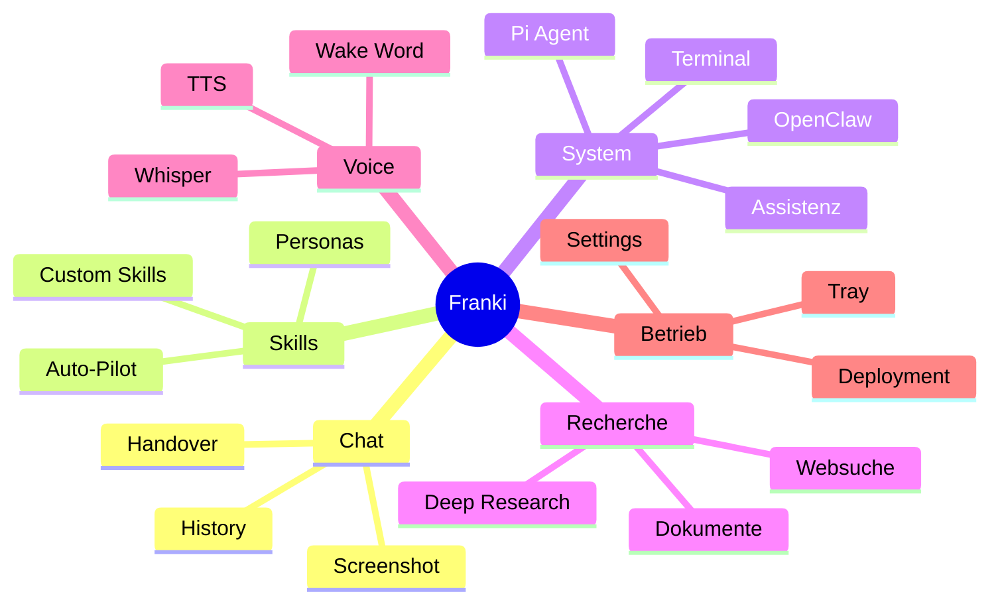

# User Stories — Desktop Mini Agent (Franki)

**Version:** 1.1.5  
**Persona:** Franki — charmanter, lockerer persönlicher KI-Buddy  
**Plattform:** macOS (Apple Silicon)

---

## Legende

| Priorität | Bedeutung |
|-----------|-----------|
| P1 | Kernfunktion — ohne diese ist der Agent nicht nutzbar |
| P2 | Wichtige Erweiterung — starkes Nutzenversprechen |
| P3 | Nice-to-have — Spezialanwendung |

| Status | Bedeutung |
|--------|-----------|
| ✅ | Implementiert |
| 🔶 | Teilweise / abhängig von externem Setup |
| 📋 | Konzept / geplant |

---

## Epic 1: Chat & Bildschirmkontext

| ID | User Story | Akzeptanzkriterien | Prio | Status |
|----|-----------|-------------------|------|--------|
| US-01 | Als Nutzer möchte ich eine schwebende Chat-Oberfläche am Bildschirmrand, damit ich jederzeit Fragen stellen kann, ohne meine Arbeit zu unterbrechen. | Fenster ist always-on-top, frameless, transparent; Bubble-Modus minimiert auf Icon | P1 | ✅ |
| US-02 | Als Nutzer möchte ich, dass der Agent meinen Bildschirm sieht, damit er Fragen zu sichtbaren Inhalten beantworten kann. | Screenshot wird bei aktivem `screenchat` mitgesendet; Antwort bezieht sich auf sichtbaren Kontext | P1 | ✅ |
| US-03 | Als Nutzer möchte ich einen interaktiven Screenshot-Ausschnitt wählen, damit nur der relevante Bereich analysiert wird. | Tray-Menü oder Button startet macOS-Crop-Tool; Pfad wird an Query übergeben | P2 | ✅ |
| US-04 | Als Nutzer möchte ich Dateien (PDF, Bilder) in den Chat ziehen, damit der Agent deren Inhalt verarbeitet. | Drag & Drop; PDF wird geparst; Inhalt im Prompt | P2 | ✅ |
| US-05 | Als Nutzer möchte ich Markdown-formatierte Antworten sehen, damit Code und Listen lesbar sind. | `marked` + `DOMPurify` rendern sicher HTML | P1 | ✅ |
| US-06 | Als Nutzer möchte ich den Chat-Verlauf behalten (bis 20 Nachrichten), damit Folgefragen Kontext haben. | History wird mitgesendet; Heatmap zeigt Füllstand | P1 | ✅ |
| US-07 | Als Nutzer möchte ich bei vollem Kontext eine intelligente Zusammenfassung (Handover), damit ich weitersprechen kann ohne alles zu verlieren. | Brain-Icon → LLM-Handover; History wird komprimiert | P2 | ✅ |

---

## Epic 2: Skills & Personas

| ID | User Story | Akzeptanzkriterien | Prio | Status |
|----|-----------|-------------------|------|--------|
| US-10 | Als Nutzer möchte ich Skills aktivieren/deaktivieren, damit der Agent sich an meine Aufgabe anpasst. | Skill-Badges in UI; Prompts werden kombiniert | P1 | ✅ |
| US-11 | Als Nutzer möchte ich den Auto-Pilot nutzen, damit der Agent selbst die passenden Skills wählt. | Router-LLM wählt Skills vor Hauptanfrage | P2 | ✅ |
| US-12 | Als Nutzer möchte ich eigene Skills definieren, damit ich wiederkehrende Rollen speichern kann. | Prompt Manager in Einstellungen; `customSkills` in config | P2 | ✅ |
| US-13 | Als Nutzer möchte ich zwischen Personas wechseln (Texter, Influencer, Kompakt), damit der Antwortstil passt. | Skill-Prompts ändern Ton und Länge | P2 | ✅ |
| US-14 | Als Nutzer möchte ich Trading-/Chart-Skills nutzen, damit ich Daytrading-Empfehlungen mit CRV bekomme. | `stockcheck`, `tradingexpert` mit Screenshot + Websuche | P3 | ✅ |
| US-15 | Als Nutzer möchte ich Preisvergleiche als Kacheln sehen, damit ich schnell das günstigste Angebot finde. | `mrbillig` + `search_product_prices` → HTML-Tiles | P3 | ✅ |

---

## Epic 3: System & Automatisierung

| ID | User Story | Akzeptanzkriterien | Prio | Status |
|----|-----------|-------------------|------|--------|
| US-20 | Als Nutzer möchte ich Terminal-Befehle über den Agent ausführen lassen, damit ich Systemaufgaben delegieren kann. | `execute_terminal_command`; Firewall + Approval | P1 | ✅ |
| US-21 | Als Nutzer möchte ich vor riskanten Befehlen bestätigen müssen, damit mein System geschützt ist. | Approval-Modal; KI-Firewall bewertet Risiko | P1 | ✅ |
| US-22 | Als Nutzer möchte ich AppleScript-Aufgaben automatisieren, damit macOS-Apps gesteuert werden. | `execute_applescript`; Blocklist für gefährliche Befehle | P2 | ✅ |
| US-23 | Als Nutzer möchte ich Dateien bearbeiten lassen, damit der Agent Code/Konfiguration anpasst. | `edit_file` mit Approval | P2 | ✅ |
| US-24 | Als Nutzer möchte ich Maus und Tastatur per KI steuern lassen, damit der Agent UI-Aufgaben übernimmt. | `assistenz` + `execute_computer_action`; Scratchpad; Overlay-Feedback | P2 | ✅ |
| US-25 | Als Nutzer möchte ich den Risikomodus für Assistenz wählen (guided/assist/auto), damit ich Kontrolle vs. Geschwindigkeit abwägen kann. | Einstellung `assistRisk` steuert Bestätigungsverhalten | P2 | ✅ |
| US-26 | Als Nutzer möchte ich komplexe OS-Aufgaben an OpenClaw delegieren, damit High-Level-Ziele umgesetzt werden. | `mac_controller` + `execute_advanced_os_task` | P3 | ✅ |
| US-27 | Als Nutzer möchte ich Coding-Aufgaben an den Pi Coding Agent delegieren, damit größere Codebases bearbeitet werden. | `delegate_to_pi_coding_agent` | P3 | ✅ |

---

## Epic 4: Recherche & Dokumente

| ID | User Story | Akzeptanzkriterien | Prio | Status |
|----|-----------|-------------------|------|--------|
| US-30 | Als Nutzer möchte ich Websuchen durch den Agent, damit ich aktuelle Informationen erhalte. | `search_web` via DuckDuckGo Lite | P1 | ✅ |
| US-31 | Als Nutzer möchte ich tiefe Recherchen als Dossier-Download, damit umfangreiche Ergebnisse nicht den Chat sprengen. | `deepresearch` → mehrfache Suche + `create_document` | P2 | ✅ |
| US-32 | Als Nutzer möchte ich generierte Dokumente speichern, damit ich sie lokal ablegen kann. | Download-Button + nativer Save-Dialog | P2 | ✅ |
| US-33 | Als Nutzer möchte ich URLs im Browser öffnen lassen, damit der Agent mich zu Quellen führt. | `open_website` | P2 | ✅ |

---

## Epic 5: Simulation & Prognose (MiroFish)

| ID | User Story | Akzeptanzkriterien | Prio | Status |
|----|-----------|-------------------|------|--------|
| US-40 | Als Nutzer möchte ich schnelle Marktprognosen im Chat, damit ich ohne Wartezeit Einschätzungen bekomme. | `mirofish` Lite — in-chat Simulation | P3 | ✅ |
| US-41 | Als Nutzer möchte ich eine echte Multi-Agenten-Simulation (5–10 Min.), damit ich fundierte Prognose-Berichte erhalte. | `mirofish_full` + Backend auf :5001 | P3 | 🔶 |

---

## Epic 6: Sprache & Eingabe

| ID | User Story | Akzeptanzkriterien | Prio | Status |
|----|-----------|-------------------|------|--------|
| US-50 | Als Nutzer möchte ich per Mikrofon sprechen, damit ich hands-free Fragen stellen kann. | Audio-Aufnahme → Whisper-Transkription | P2 | ✅ |
| US-51 | Als Nutzer möchte ich Antworten vorgelesen bekommen, damit ich nicht lesen muss. | OpenAI TTS oder lokale `speechSynthesis` | P2 | ✅ |
| US-52 | Als Nutzer möchte ich ein Wake-Word konfigurieren, damit der Agent auf Sprachaktivierung reagiert. | Web Speech API; Standard „Hey Inge“ | P3 | ✅ |

---

## Epic 7: Konfiguration & Betrieb

| ID | User Story | Akzeptanzkriterien | Prio | Status |
|----|-----------|-------------------|------|--------|
| US-60 | Als Nutzer möchte ich API-Keys sicher speichern, damit ich OpenAI/Gemini nutzen kann. | `safeStorage`-Verschlüsselung; Settings-Panel | P1 | ✅ |
| US-61 | Als Nutzer möchte ich das LLM-Modell wählen (OpenAI, Gemini, lokal), damit ich Kosten/Qualität steuere. | Modell-Dropdown; lokales GGUF optional | P1 | ✅ |
| US-62 | Als Nutzer möchte ich kumulierte API-Kosten sehen, damit ich Ausgaben im Blick habe. | `totalCost` in Config und UI | P2 | ✅ |
| US-63 | Als Nutzer möchte ich Agent-Logs einsehen, damit ich nachvollziehen kann, was im Hintergrund passiert. | Logs-Panel; `agent-log` Events | P2 | ✅ |
| US-64 | Als Nutzer möchte ich die App aus Programme starten, damit sie wie eine native macOS-App läuft. | electron-packager → `.app` in `/Applications` | P1 | ✅ |
| US-65 | Als Nutzer möchte ich die App über das Tray-Icon steuern, damit sie im Hintergrund verfügbar bleibt. | Tray-Klick toggelt Fenster; Kontextmenü Screenshot | P1 | ✅ |

---

## Epic 8: Zukunft (Konzept)

| ID | User Story | Akzeptanzkriterien | Prio | Status |
|----|-----------|-------------------|------|--------|
| US-70 | Als Nutzer möchte ich einen Observe→Think→Act→Verify-Loop, damit Desktop-Automatisierung zuverlässiger wird. | Accessibility API; Verifikation nach Aktion | P3 | 📋 |

*Siehe `docs/CONCEPT_DesktopInteractionSkill.md`*

---

## Story-Map (Übersicht)

