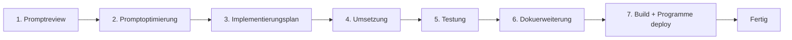

# Entwicklungsworkflow — Desktop Mini Agent

Jede Änderung am Agenten (Code, Prompts, Skills, Tools) folgt diesem festen Ablauf.

---

## 1. Promptreview

**Ziel:** Bestehende Prompts und Skill-Definitionen kritisch prüfen, bevor etwas geändert wird.

| Prüfpunkt | Frage |
|-----------|-------|
| Klarheit | Ist die Rolle/Persona eindeutig definiert? |
| Tool-Hinweise | Werden relevante Tools explizit genannt, wenn der Skill sie braucht? |
| Konflikte | Widersprechen sich aktive Skills (z. B. `compact` + `writer`)? |
| Sicherheit | Enthält der Prompt Scratchpad-/Risiko-Anforderungen (Assistenz, Mac Controller)? |
| Redundanz | Überlappt der Prompt mit `DEFAULT_PROMPT` oder anderen Skills unnötig? |
| Sprache | Ist der Prompt konsistent (Deutsch, wie die UI)? |

**Relevante Dateien:**
- `main.js` → `DEFAULT_PROMPT`, `defaultSkills[]`
- `docs/skills/*.md` → Skill-Beschreibungen
- Nutzer-definierte Skills in `config.json` → `customSkills`

**Output:** Review-Protokoll mit gefundenen Schwachstellen (kurze Liste).

---

## 2. Promptoptimierung

**Ziel:** Prompts gezielt verbessern, ohne Scope zu sprengen.

**Regeln:**
- Nur ändern, was im Review identifiziert wurde
- Ein Skill = eine klar abgegrenzte Verhaltensänderung
- Tool-Namen exakt wie in `main.js` definiert (`search_web`, `execute_computer_action`, …)
- Scratchpad-Pflicht bei risikoreichen Aktionen beibehalten
- Keine neuen Skills ohne Feature- und Testanforderungs-Update

**Output:** Konkrete Prompt-Änderungen (Diff oder Vorher/Nachher).

---

## 3. Implementierungsplan

**Ziel:** Änderungen strukturieren, bevor Code geschrieben wird.

**Plan enthält:**
1. **Scope** — Was wird geändert? (Dateien, Skills, Tools, UI)
2. **Abhängigkeiten** — APIs, externe Dienste (MiroFish, OpenClaw, Pi)
3. **Risiken** — Sicherheit, Breaking Changes, macOS-Berechtigungen
4. **Schritte** — Nummerierte Umsetzungsschritte
5. **Betroffene Tests** — Verweis auf `docs/testanforderung.md` (welche TA-xx)

**Output:** Kurzer Implementierungsplan (1 Seite).

---

## 4. Umsetzung

**Ziel:** Code/Prompt-Änderungen implementieren.

**Konventionen:**
- Main-Prozess-Logik → `main.js`
- UI/Renderer → `renderer.js`, `index.html`
- IPC-Brücke → `preload.js`
- Externe Orchestrierung → `mirofish_orchestrator.js`
- Bestehende Patterns und Namenskonventionen beibehalten
- Kein Over-Engineering; minimaler korrekter Diff

---

## 5. Testung gemäß Testanforderung

**Ziel:** Definierte Tests aus `docs/testanforderung.md` ausführen.

| Änderungsgröße | Testumfang |
|----------------|------------|
| Kleine Änderung (Prompt-Tweak, UI-Text) | Relevante TA-xx des betroffenen Bereichs |
| Mittlere Änderung (neuer Skill, Tool-Anpassung) | Alle TA des Moduls + Regression Kernfunktionen |
| Große Änderung (Architektur, neues Tool, IPC) | **Vollständiger Testlauf** aller TA |

**Testarten:**
- Manuell in der laufenden App (Entwicklung: `npm start`)
- Nach Build: installierte App unter **Programme**
- Hilfsskripte: `test_mouse.js`, `test_models.js`, `check_models.js`

**Output:** Testprotokoll (bestanden / fehlgeschlagen / offen).

---

## 6. Dokuerweiterung

**Ziel:** Dokumentation synchron mit dem Code halten.

**Bei jeder Änderung prüfen und ggf. aktualisieren:**

| Dokument | Wann aktualisieren |
|----------|-------------------|
| `docs/userstories.md` | Neue Nutzerfunktion |
| `docs/features.md` | Neues/geändertes Feature |
| `docs/schnittstellen.md` | IPC, API, Tool-Änderung |
| `docs/technische-systemdoku.md` | Architektur, Stack, Deployment |
| `docs/testanforderung.md` | Neue Testfälle |
| `docs/skills/*.md` | Skill-Änderungen |
| `docs/tools.md` | Tool-Änderungen |

---

## 7. Deployment unter Programme (Pflicht nach Änderungen)

Nach **jeder** Code-Änderung, die in der installierten App wirksam sein soll:

```bash
cd /Users/holgervoigt/Documents/SciPoly/DesktopMiniAgent

# 1. Abhängigkeiten aktuell halten (bei package.json-Änderungen)
npm install

# 2. App bauen (darwin arm64)
npm run build

# 3. Alte App beenden (falls läuft)
pkill -f "desktop-mini-agent" || true

# 4. Neue App nach Programme kopieren
cp -R release-builds/desktop-mini-agent-darwin-arm64/desktop-mini-agent.app /Applications/

# 5. App neu starten
open /Applications/desktop-mini-agent.app
```

**Hinweise:**
- Erster Start nach Update: ggf. **Bildschirmaufnahme**, **Bedienungshilfen** und **Mikrofon** erneut erlauben
- `npm run build` setzt Accessibility-TCC für Bundle-ID `com.electron.desktop-mini-agent` zurück
- Konfiguration (`config.json`) bleibt in `~/Library/Application Support/desktop-mini-agent/` erhalten
- Entwicklung ohne Build: `npm start` (lädt Code direkt aus dem Projektordner)

---

## Workflow-Diagramm


